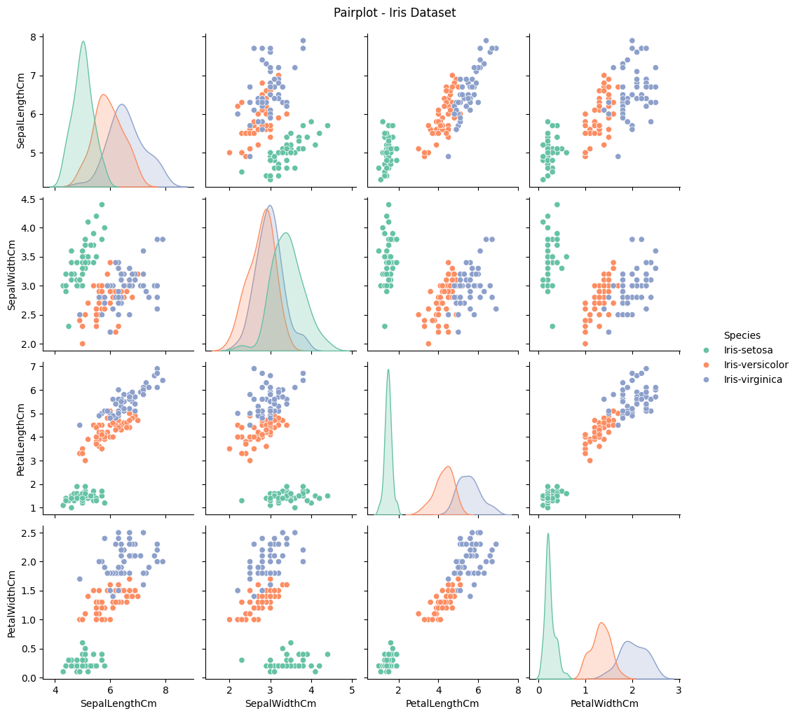
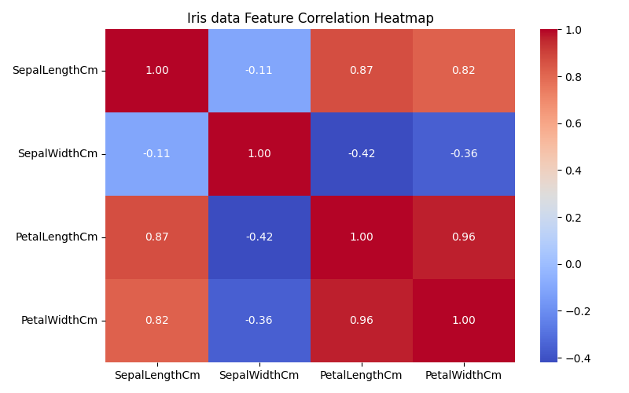
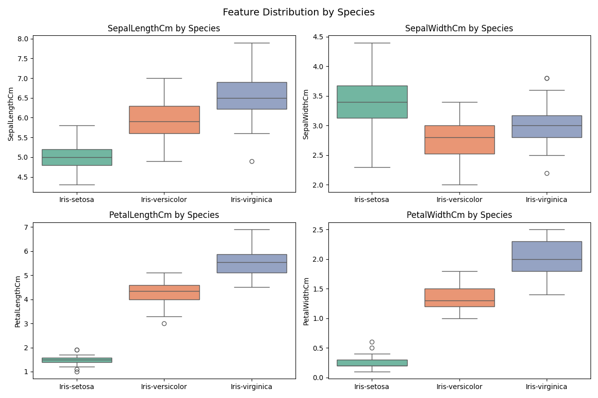
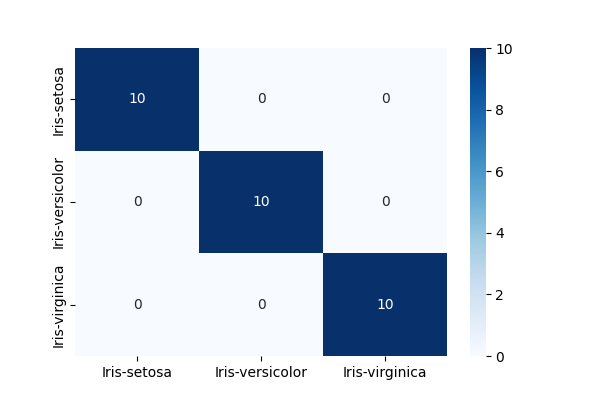

# CodeAlpha_IrisFlowerClassification
A Machine Learning project that classifies Iris flowers into **Setosa**, **Versicolor**, and **Virginica** species using the **K-Nearest Neighbors (KNN)** algorithm.

## Features
* Exploratory Data Analysis (EDA)
* Data visualization with Matplotlib and Seaborn
* Correlation heatmap, pairplot, and boxplots
* KNN model training and prediction
* Model evaluation using accuracy score and confusion matrix

## Technologies Used
* Python, Pandas, NumPy, Matplotlib, Seaborn and Scikit-learn

## Dataset
The project uses the  Iris dataset from kaggle

## Results
The trained KNN model achieves high classification accuracy and is evaluated using a confusion matrix and performance metrics.

## How to Run
```bash
git clone https://github.com/biyimide/CodeAlpha_IrisFlowerClassification.git
cd CodeAlpha_IrisFlowerClassification
pip install -r requirements.txt
python iris_classifier.py
```

## Author
Olamide ogunbiyi- Developed as part of the CodeAlpha Data science Internship Program.
## 📊 Visualizations

### Pair Plot


### Correlation Heatmap


### Boxplots


### Confusion Matrix

